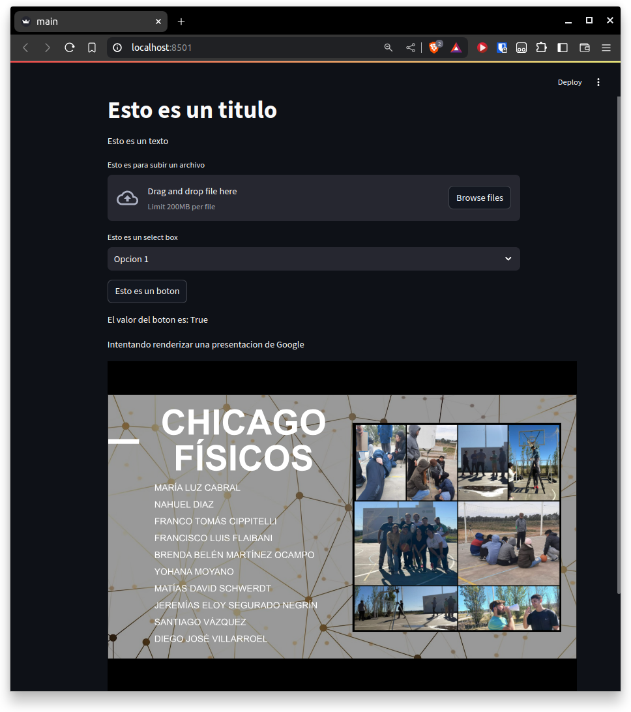

# Test Streamlit

Streamlit is a Python library that allows you to create web applications. 
In this repository I am testing the library to share my experience with my partners.


### Run main.py with this command:

```py
streamlit run main.py
```


